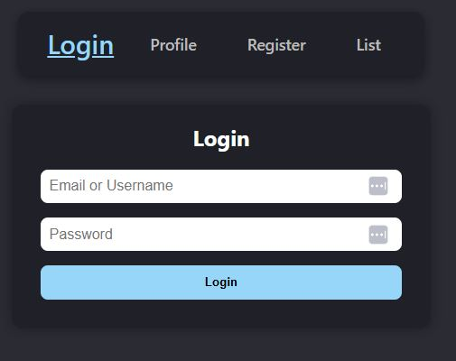
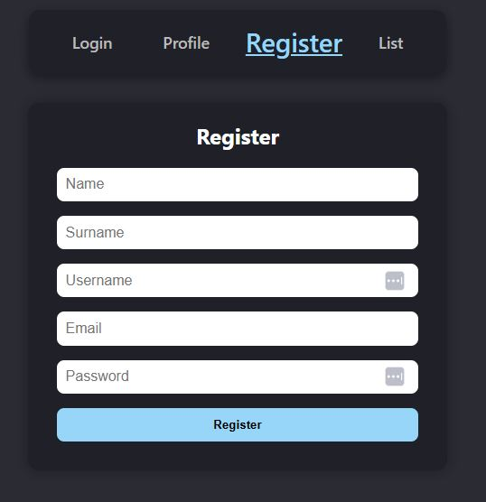

# Simple List App

A clean and modern web application built with React and TypeScript to manage user accounts and eventually create, edit, and delete items from a simple list.

## 🔗 Backend

This project uses a [GraphQL API backend](https://github.com/DZaf/graphql-api). Make sure it's running for full functionality.

## 🚀 Features

- User registration and authentication
- Add job in the list
- Protected routes
- Apollo Client integration for GraphQL
- Modular SCSS styling
- TypeScript for strict type safety

## 📸 Screenshots





## 📋 TODO

These features are under development and will be added soon:

- ✅ Display a list of items make UI better
- ⏳ Edit and remove items from the list
- ⏳ Add unit tests using **Jest**
- ⏳ When adding a job to check if exists

## 📁 Project Structure

```
src/
├── app/                 # Store and Apollo Client setup
├── components/          # Reusable and page-specific components
├── graphql/             # GraphQL queries and mutations
├── hooks/               # Custom hooks
├── pages/               # Main pages like Home, Login, Profile
├── slices/              # Redux slices for state management
├── types/               # TypeScript types
├── App.tsx              # Main application component
└── index.tsx            # Entry point
```

## 📦 Installation

1. Clone the repository:
   ```bash
   git clone https://github.com/DZaf/simpleListApp.git
   cd simple-list-app
   ```

2. Install dependencies:
   ```bash
   npm install
   ```

3. Start the development server:
   ```bash
   npm start
   ```

## 🧪 Running Tests

> Tests will be written using **Jest** and integrated in future iterations.

```bash
npm test
```

## 🛠️ Tech Stack

- React
- TypeScript
- Redux Toolkit
- Apollo Client
- GraphQL
- SCSS Modules
- Jest (planned)

## 📄 License

MIT License — feel free to use this project as a starter or learning resource.
